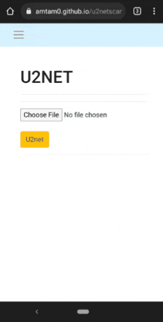
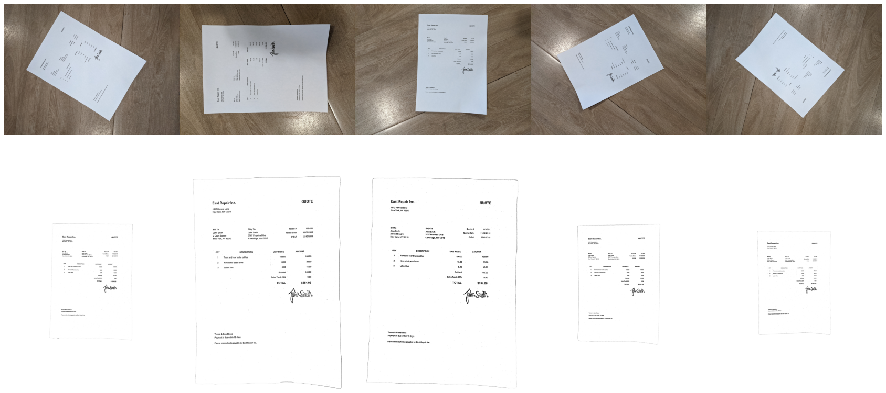
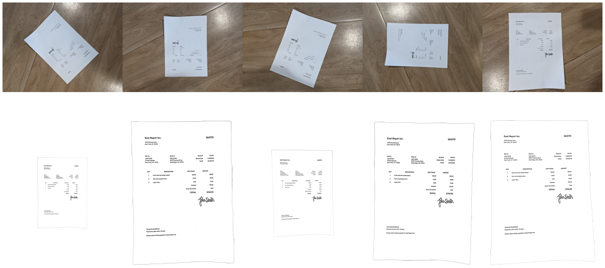
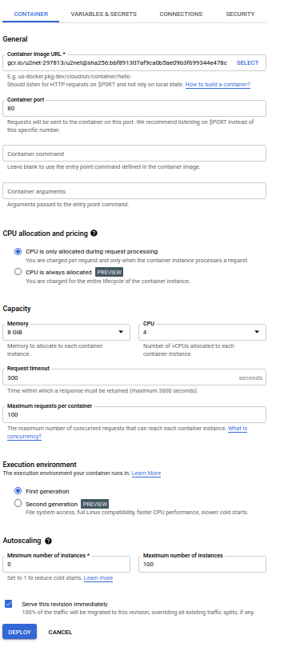

## Responsive Doc. scanner using U^2-Net, Textcleaner and Tesseract

### Toolset

- U^2-Net is used for background removal
- Textcleaner is used for image cleaning and line deskew (max 5 degrees)
- Tesseract is used for text angle rotation
- Deskew is used for line deskew (between 5 and 45 degrees)

### Examples
Tested one document on smartphone camera with different angles

 

### To build & deploy
1. Clone thee repo
2. Download the model: check `app/saved_models/README.md`
3. Build Docker image : `docker build -t <REPOSITORY-NAME>/<IMAGE>:<TAG> .`
4. Test locally : Run Docker image and check if api is working by running http://localhost:10000
    - CPU : `docker run -it -v $PWD:/LOCAL/ -p 10000:80 <REPOSITORY-NAME>/<IMAGE>:<TAG>`
    - GPU : `docker run -it --gpus all -v $PWD:/LOCAL/ -p 10000:80 <REPOSITORY-NAME>/<IMAGE>:<TAG>`
5. Push docker image to Dockerhub (optional):
    - Check: https://docs.docker.com/docker-hub/repos/ for account setup
    - Create in Dockerhub Repo similar to the name of yout Image ID : `<REPOSITORY-NAME>` 
    - Run `docker push <REPOSITORY-NAME>/<IMAGE>:<TAG>`
6. Deploy to Cloud Run (optional):
    - Create your google cloud account
    - Push Docker Image to Google Container Registry
        - create new project called `[PROJECT-ID]`
        - Open Cloud shell in your Google account and run:
        `docker pull <REPOSITORY-NAME>/<IMAGE>:<TAG>`
        `docker tag [IMAGE] gcr.io/[PROJECT-ID]/[IMAGE]`
        `docker push gcr.io/[PROJECT-ID]/[IMAGE]`
        more detail in this [link](https://support.terra.bio/hc/en-us/articles/360035638032-Publish-a-Docker-container-image-to-Google-Container-Registry-GCR-)
    - Create CloudRun Service, and select Container that was created
        - Screenshot of the config - for demo purpose, it will be cost free
        
    - Click Deploy, and test the Api Url that will display

### Limits and Areas for improvements
- Speed: It takes 7 to 10 seconds to process one image (serverless Cloud Run)
    With Gpu we can save 2 to 3 seconds (U^2-Net is 3 times faster)
- Textcleaner is slow but works better on image cleaning, but needs some manual fine-tuning

### References
- U^2-Net https://github.com/xuebinqin/U-2-Net.git
- Textcleaner http://www.fmwconcepts.com/imagemagick/textcleaner/
- Tesseract https://github.com/tesseract-ocr/tesseract
- Deskew https://github.com/sbrunner/deskew.git